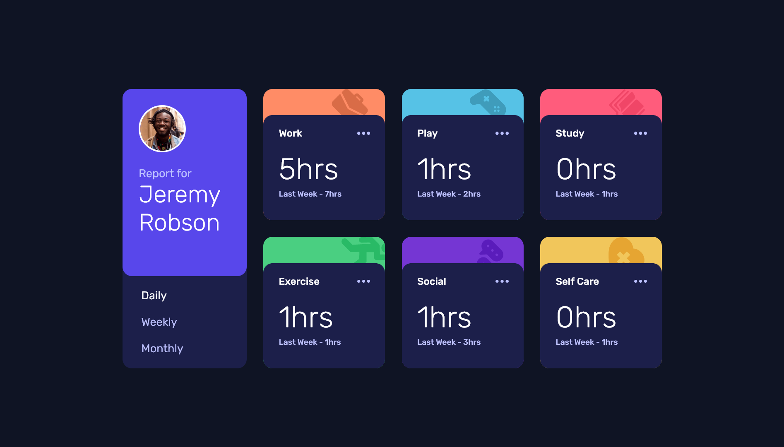

# Frontend Mentor - Time tracking dashboard solution

This is a solution to the [Time tracking dashboard challenge on Frontend Mentor](https://www.frontendmentor.io/challenges/time-tracking-dashboard-UIQ7167Jw). Frontend Mentor challenges help you improve your coding skills by building realistic projects.

## Table of contents

- [Overview](#overview)
  - [The challenge](#the-challenge)
  - [Screenshot](#screenshot)
  - [Links](#links)
- [My process](#my-process)
  - [Built with](#built-with)
  - [What I learned](#what-i-learned)
  - [Continued development](#continued-development)
- [Author](#author)

**Note: Delete this note and update the table of contents based on what sections you keep.**

## Overview

### The challenge

Users should be able to:

- View the optimal layout for the site depending on their device's screen size
- See hover states for all interactive elements on the page
- Switch between viewing Daily, Weekly, and Monthly stats

### Screenshot

### Links

- Solution URL: [GitHub](https://github.com/WolfMozart8/time-tracking-angular)
- Live Site URL: [Github pages](https://wolfmozart8.github.io/time-tracking-angular/)

## My process

### Built with

- Semantic HTML5 markup
- CSS custom properties
- Flexbox
- CSS Grid
- Mobile-first workflow
- [Angular](https://angular.io/) - JS Framwork

### What I learned

I learned Angular (this is my first time) and i have noticed significant improvements in my TypeScript and CSS skills.

### Continued development

I encountered some issues with Angular components, especially those that use 'display: flex,' for example. I wasn't entirely sure how to correctly bind them with other components. To address this, I plan to work on more Angular projects to enhance my skills.

## Author

- Frontend Mentor - [@WolfMozart8](https://www.frontendmentor.io/profile/WolfMozart8)
